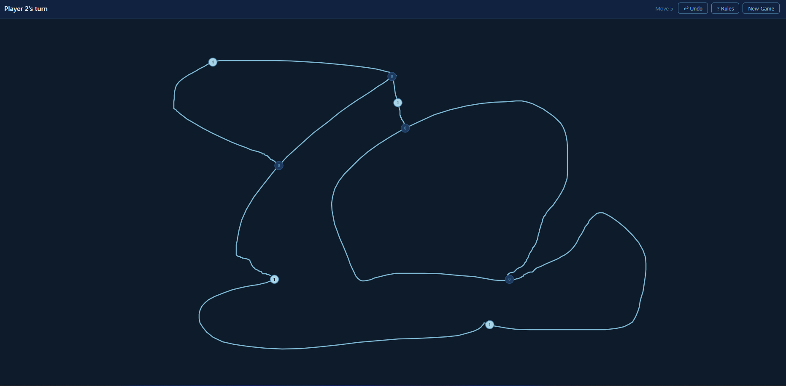

# Sprouts

A two-player browser implementation of [Sprouts](https://en.wikipedia.org/wiki/Sprouts_(game)) — the classic pencil-and-paper topology game invented by John Conway and Michael Paterson in 1967.

**[Play it live →](https://main.d37ybsoeyysuqo.amplifyapp.com/)**



---

## How to Play

Sprouts is a two-player strategy game played on a shared screen.

1. **Draw a curve** between any two live spots, or from a spot back to itself (a loop).
2. **Place a new spot** — one appears automatically at the midpoint of your curve.
3. **Rules:**
   - Curves cannot cross existing curves or pass through existing spots.
   - Each spot can have at most **3 connections**. A spot with 3 connections is dead.
   - A loop counts as **2 connections** on the same spot.
   - The new midpoint spot starts with **2 connections** (one to each side of the curve).
4. **The player who makes the last valid move wins** (normal play convention).

A game starting with `n` spots lasts at most `3n − 1` moves.

---

## Features

- Freehand curve drawing with mouse and touch (mobile-friendly)
- Full rule enforcement — crossing detection, spot-through detection, self-crossing loops
- Automatic game-over detection with winner announcement
- **Undo** last move
- Move counter
- Spot labels showing remaining free connections
- Start-spot highlight while drawing
- Rules reference modal
- Keyboard shortcuts: `N` new game · `U` undo · `?` rules · `Esc` close modal
- Dark navy aesthetic
- Responsive — works on desktop, tablet, and phone

---

## Technical Details

- **Three static files** — `index.html` (markup), `sprouts.css` (styles), `sprouts.js` (all game logic). No build step, no dependencies, no network requests at runtime.
- **Pure HTML5 Canvas** rendering with HiDPI support.
- **Modules:** `GameState` · `Geometry` · `Validator` · `Renderer` · `InputHandler` · `GameController` · `UI`
- **Move validation:** CCW orientation segment intersection, point-to-segment distance, polyline arc-length midpoint.
- **Game-over detection:** multi-probe reachability check (straight line + Bézier arcs) with endpoint exclusion zones to avoid false positives.
- **Property-based tests** using [fast-check](https://fast-check.dev/) covering 11 correctness properties, runnable in Node.js without a browser.

---

## Running Locally

Just open the file:

```bash
open sprouts-game/index.html
```

Or serve it with any static server:

```bash
npx serve sprouts-game
# or
python -m http.server --directory sprouts-game
```

---

## Running Tests

```bash
cd sprouts-game
npm install
node --test sprouts.test.js
```

Tests cover the pure logic modules (GameState, Geometry, Validator, GameController.applyMove) and run entirely in Node.js — no browser required.

---

## Deploying to AWS Amplify

The repo includes `amplify.yml` for zero-config deployment.

1. Push the `sprouts-game/` directory (or the whole repo) to GitHub.
2. In the [Amplify Console](https://console.aws.amazon.com/amplify/), connect the repository.
3. Amplify will detect `amplify.yml` and deploy `index.html` as the artifact.
4. Point a Route 53 subdomain at the Amplify app domain.

No build step is required — Amplify serves the file directly.

---

## Project Structure

```
sprouts-game/
├── index.html        # HTML shell — markup and asset references
├── sprouts.css       # All styles
├── sprouts.js        # All game logic (GameState, Geometry, Validator,
│                     #   Renderer, InputHandler, GameController, UI, Bootstrap)
├── sprouts.test.js   # Property-based and unit tests (fast-check)
├── package.json      # Test runner config
├── amplify.yml       # AWS Amplify deployment config
└── README.md
```

---, m 

## License

MIT
